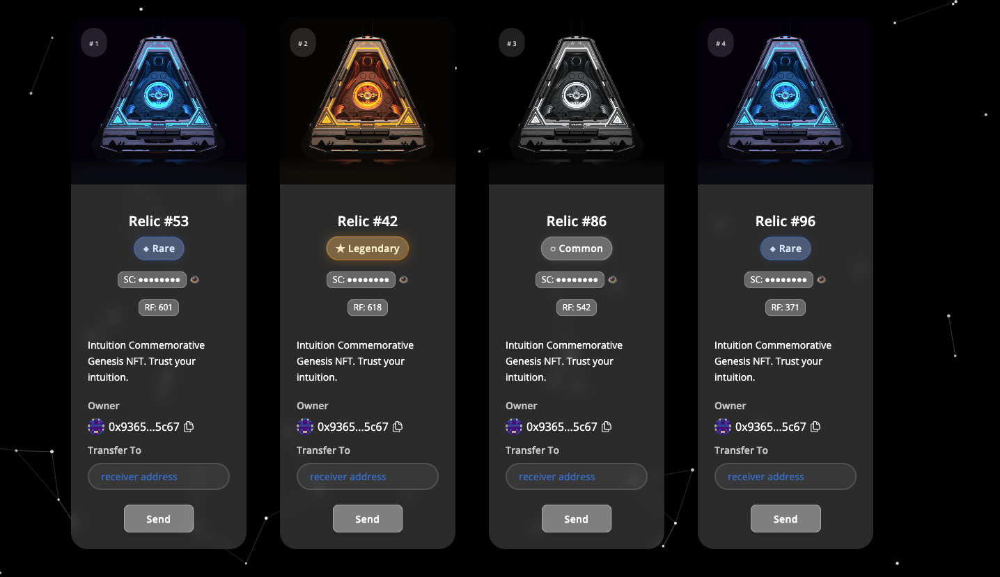
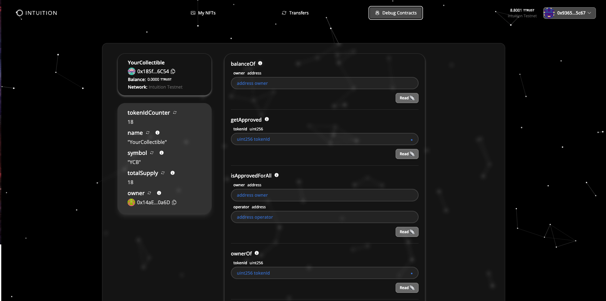
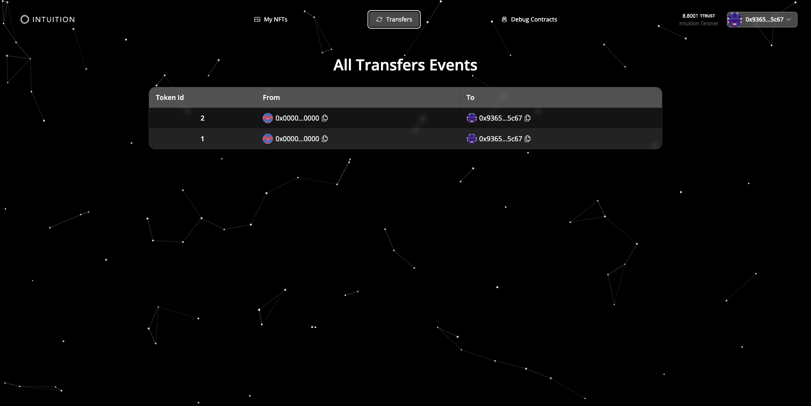
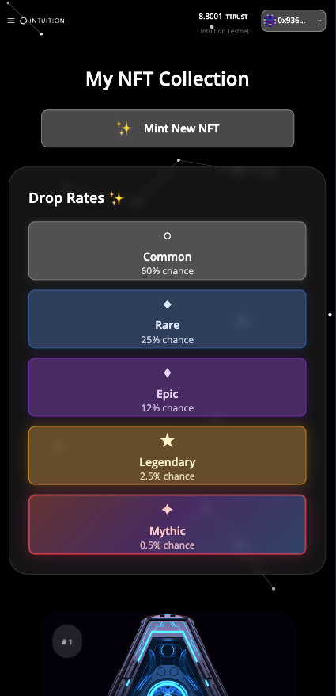
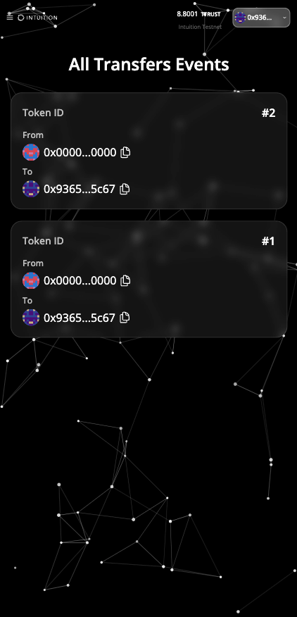
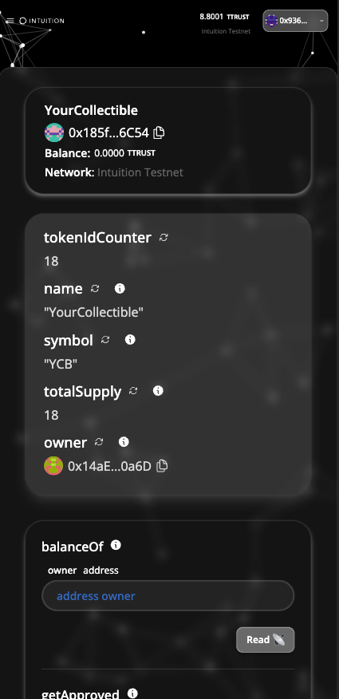

# 🎨 Premium NFT Collection

## Core Functionality

🎲 **Smart NFT Generation**

- Mints NFTs with randomized attributes
- Automatic rarity calculation based on trait combinations
- Unique resonance frequencies and secret codes for each NFT

## Screenshots


### Desktop Version

| My NFTs Page                          |
| ------------------------------------- |
|  |

| Debug Page                         | Transfers Page                             |
| ---------------------------------- | ------------------------------------------ |
|  |  |


### Mobile Version

| My NFTs Mobile                              | Transfers Mobile                                 |
| ------------------------------------------- | ------------------------------------------------ |
|  |  |

| Debug Mobile                             |
| ---------------------------------------- |
|  |


## Quick Start

```bash
# Install dependencies
yarn install

# Start local blockchain
yarn chain

# Deploy contracts
yarn deploy

# Launch application
yarn start
```

Open [http://localhost:3000](http://localhost:3000) and connect your wallet to start minting NFTs.

## How to Use

1. **Connect Wallet** - Use MetaMask or any Web3 wallet
2. **Mint NFTs** - Click "Mint NFT" to generate unique NFTs with random attributes
3. **View Collection** - Browse your NFTs with rarity indicators and visual effects
4. **Transfer NFTs** - Send individual NFTs or use batch selection for multiple transfers
5. **Filter & Search** - Find specific NFTs using the search bar or rarity filters


Built with ❤️ and Intuition 👁️
